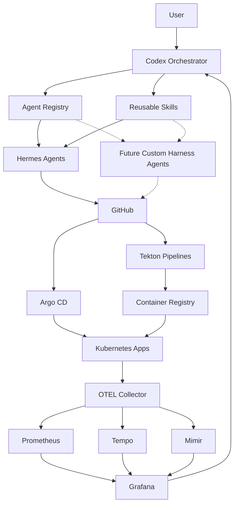
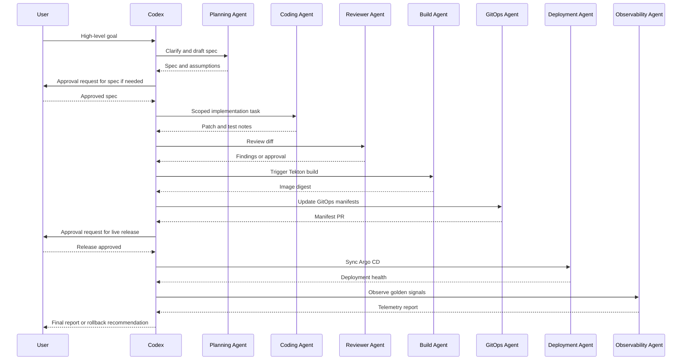
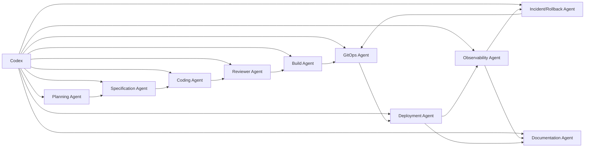
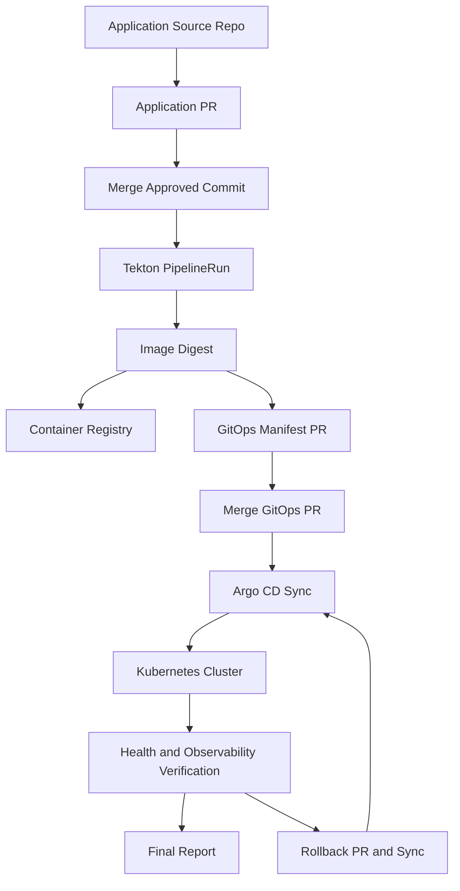
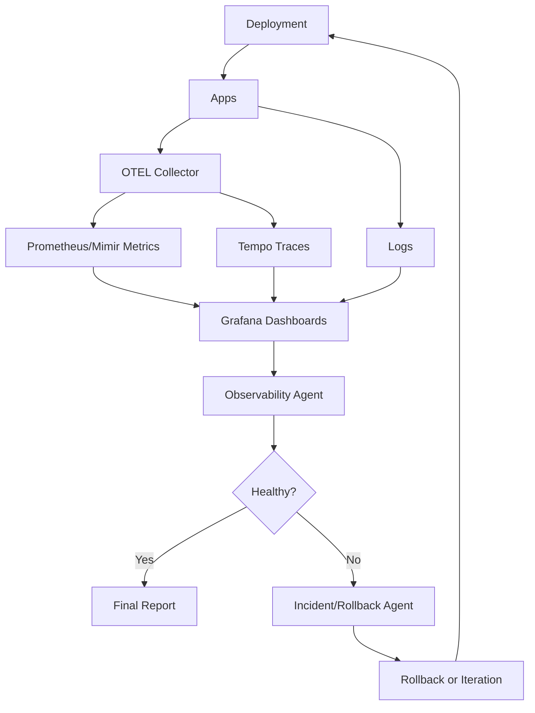

# Agentic Homelab SDLC Master Plan

Date: 2026-05-10

This document defines a practical first architecture for an agentic homelab SDLC platform where Codex acts as the top-level orchestrator and delegates work to specialized agents, reusable skills, and Kubernetes-hosted delivery infrastructure.

## 1. Executive Summary

The target system is a homelab software delivery control plane. A user gives Codex a high-level outcome such as "add a feature," "fix this deployment," or "ship a new internal tool." Codex turns that outcome into a specification, decomposes it into work, assigns bounded tasks to agents, supervises code changes, triggers builds, updates GitOps manifests, syncs Argo CD, checks deployment health, reviews observability data, and either reports success or safely stops with a rollback or escalation path.

The architecture separates four concepts:

| Layer | Responsibility | Example |
| --- | --- | --- |
| Codex planner/orchestrator | Owns goal intake, planning, routing, approval gates, final judgment, and cross-agent coordination. | "Plan this rollout, assign coding and observability work, require approval before Argo sync." |
| Hermes agents | Initial worker runtime for delegated tasks with scoped tools and context. | Coding agent edits a repo; observability agent runs PromQL; GitOps agent updates Helm values. |
| Skills | Reusable operational playbooks with instructions, commands, safety checks, templates, and optional scripts. | `argocd-health-check`, `tekton-build-trigger`, `prometheus-query-runner`. |
| Cluster services | Runtime and observability infrastructure that agents use but do not own. | Tekton, registry, Argo CD, Grafana, Prometheus, Mimir, Tempo, OTEL collector. |

Codex is not the build system, registry, Git provider, or cluster operator. It is the coordinating brain. Workers perform constrained work. Skills encode how work should be done. Kubernetes services provide execution, state, telemetry, and delivery guarantees.

The first version should be homelab-practical:

- Start with read-only discovery and sandbox deployments.
- Keep GitOps as the source of truth.
- Prefer dry runs before mutation.
- Require human approval for risky, destructive, or production-like actions.
- Never expose high-value secrets to general-purpose agents.
- Capture an audit trail for every tool call, cluster action, GitHub action, and deployment decision.

## 2. End-to-End Workflow

The canonical lifecycle is:

1. User gives Codex a goal.
2. Codex clarifies requirements and writes a spec.
3. Codex decomposes the spec into tasks.
4. Codex assigns tasks to specialized agents.
5. Agents edit code, test, build, release, deploy, observe, and report.
6. Codex reviews the evidence and decides whether to iterate, roll back, stop, or declare success.

| Phase | Inputs | Outputs | Responsible agent or skill | Required permissions | Failure modes | Human approval gates |
| --- | --- | --- | --- | --- | --- | --- |
| 1. Goal intake | User prompt, repo/environment hints, risk profile | Goal brief, target repo/app, initial constraints | Codex, `goal-intake` | Read repo metadata, read known environments | Ambiguous goal, wrong repo, hidden production impact | Required if target environment is unclear |
| 2. Requirements clarification | Goal brief, existing docs, user constraints | Clarified requirements, open questions, assumptions | Planning agent, `requirements-clarifier` | Read docs/issues, optional GitHub issue read | Too many unknowns, conflicting requirements | Required before broad implementation |
| 3. Specification generation | Clarified requirements, architecture context | `spec.md`, acceptance criteria, non-goals | Specification agent, `spec-writer` | Write planning docs only | Spec too broad, missing testability | Required for multi-step or risky work |
| 4. Task decomposition | Spec, repo map, dependency graph | Task list, ownership boundaries, sequence | Codex, `task-decomposer` | Read repo, read CI/GitOps layout | Tasks overlap, unsafe parallelism | Required for cross-agent execution |
| 5. Agent assignment | Task list, agent registry, permissions map | Agent run plan, contexts, tool grants | Codex, `approval-gate-manager`, `permission-checker` | Read agent registry, issue short-lived tokens | Overprivileged agent, missing tool | Required before granting write/deploy rights |
| 6. Code authoring | Assigned task, repo checkout, spec slice | Code changes, local notes | Coding agent, `repo-analyzer`, `code-writer` | Repo branch write, local test tools | Conflicts, poor fit to patterns, generated churn | Not required for sandbox branch work |
| 7. Code review | Diff, spec, tests, risk profile | Findings, requested changes, approval recommendation | Reviewer agent, `code-reviewer`, `architecture-reviewer` | Read diff, read repo | Missed security issue, superficial review | Required before PR merge |
| 8. Test execution | Code branch, test plan | Test logs, coverage notes, failures | Build/test agent, `test-runner` | Run local/containerized tests | Flaky tests, missing deps, false pass | Required to waive failed or skipped tests |
| 9. Tekton build | Merged branch or approved commit, build params | PipelineRun, image digest, build logs | Build agent, `tekton-build-trigger` | Create Tekton PipelineRun in `ci` | Bad Dockerfile, missing secret, build timeout | Required for non-sandbox image publish |
| 10. Registry push | Built image, registry credentials | Immutable image tag and digest | Build agent, `registry-publisher` | Push to approved registry path | Tag collision, credential failure | Required to overwrite mutable tags |
| 11. GitOps manifest update | Image digest, Helm/Kustomize target | Git commit/PR changing manifests | GitOps agent, `github-gitops-release` | Write GitOps branch/PR | Wrong chart, wrong namespace, drift | Required before merge to live path |
| 12. Argo CD sync | Merged GitOps change, app name | Sync operation and status | Deployment agent, `argocd-sync` | Sync approved Argo app | Sync wave failure, hook failure, drift | Required outside sandbox |
| 13. Deployment verification | Argo state, Kubernetes state, health endpoints | Verification report | Deployment agent, `argocd-health-check` | Read pods/services/ingress/events/logs | CrashLoop, readiness failure, network policy bug | Required to mark success |
| 14. Observability review | Deployment timestamp, app labels, dashboards | Metrics/traces/logs/alerts review | Observability agent, observability skills | Read Grafana/Prometheus/Mimir/Tempo/OTEL | Missing labels, telemetry gap, noisy alerts | Required for production-like services |
| 15. Rollback or iteration | Failure evidence, previous digest, Git history | Rollback PR/sync or iteration plan | Incident agent, `deployment-rollback` | Git revert PR, Argo sync, read metrics | Rollback unavailable, DB migration conflict | Required unless pre-approved emergency |
| 16. Final report | Spec, diff, tests, build, deploy, observability | Final report and audit summary | Codex, `post-deployment-report-writer` | Read all run artifacts | Missing evidence, incomplete audit | Not required |

Default autonomy rule: Codex can run read-only analysis, draft specs, create branches, run local tests, and propose changes without approval. It needs approval for merges, registry publication, live Argo sync, secret access, destructive operations, and rollback in production-like namespaces unless an emergency policy has already authorized it.

## 3. Skill Architecture

Skills are small, composable playbooks. Each skill should do one thing well, declare its required tools, state its safety limits, and return structured evidence. Skills may be instructional only, executable with helper scripts, or mixed.

### Planning and Product Skills

| Skill | Purpose and triggers | Inputs | Outputs | Tools/APIs | Permissions and safety | Example invocation |
| --- | --- | --- | --- | --- | --- | --- |
| `goal-intake` | Normalize a user goal into a delivery objective. Trigger on any high-level change request. | User prompt, repo hints, environment hints | Goal brief, constraints, target system guess | Docs search, GitHub issue read | Read-only; must surface ambiguity | "Turn this request into a goal brief with constraints and unknowns." |
| `requirements-clarifier` | Identify missing requirements and decide whether to ask the user or make safe assumptions. | Goal brief, existing docs | Clarifying questions, assumption log | Repo/docs search | Read-only; questions must be few and necessary | "Clarify requirements for this feature and list assumptions." |
| `spec-writer` | Write an implementation-ready spec. | Goal brief, clarified requirements | Spec, acceptance criteria, non-goals | Markdown templates | Write planning docs only | "Draft a spec for this feature with acceptance criteria." |
| `task-decomposer` | Split spec into safe, parallelizable tasks. | Spec, repo map | Task graph, ownership, dependency order | Repo search, dependency graph | Read-only unless writing plan | "Break this spec into agent tasks with boundaries." |
| `architecture-reviewer` | Assess design fit, risks, and integration points. | Spec, repo architecture, manifests | Architecture review, risk notes | Repo search, diagrams | Read-only by default | "Review this plan against the current platform architecture." |

### Coding Skills

| Skill | Purpose and triggers | Inputs | Outputs | Tools/APIs | Permissions and safety | Example invocation |
| --- | --- | --- | --- | --- | --- | --- |
| `repo-analyzer` | Build a concise map of repo structure, tests, build commands, and ownership. | Repo path, task | Repo map, command map | `rg`, `git`, package managers | Read-only | "Analyze this repo for the task and identify test/build commands." |
| `code-writer` | Implement a bounded code change. | Task spec, repo map | Patch, notes, touched files | Editor, tests, package tools | Branch write only; no secrets; no unrelated refactor | "Implement this task in the assigned files and run focused tests." |
| `code-reviewer` | Review diffs for bugs, regressions, and missing tests. | Diff, spec, tests | Findings with file/line refs | `git diff`, repo search | Read-only | "Review this diff as a blocking reviewer." |
| `test-runner` | Run focused and broad tests. | Test plan, repo | Test results, logs, failure summary | Language test tools, containers | May execute code in sandbox; no network unless declared | "Run the test plan and summarize failures." |
| `dependency-updater` | Update dependencies safely. | Package files, version policy | Dependency PR, changelog, risk notes | Package manager, advisories | No major bumps without approval | "Update safe patch/minor dependencies and run tests." |

### Build and CI Skills

| Skill | Purpose and triggers | Inputs | Outputs | Tools/APIs | Permissions and safety | Example invocation |
| --- | --- | --- | --- | --- | --- | --- |
| `tekton-build-trigger` | Create an approved PipelineRun. | Git ref, image name, build params | PipelineRun name, labels | Kubernetes API, Tekton | Create only in `ci`; no secret read | "Trigger a Tekton build for this commit and image target." |
| `container-build-monitor` | Watch build progress and collect logs. | PipelineRun name | Build status, logs, timing | Tekton, Kubernetes logs | Read Tekton pods/logs | "Monitor this PipelineRun until success or failure." |
| `registry-publisher` | Verify image publish and record digest. | Image tag, registry path | Digest, provenance record | Registry API, `crane`/`skopeo` | Push only to approved repo; digest preferred | "Confirm the image exists and return the immutable digest." |
| `pipeline-debugger` | Diagnose failed builds. | PipelineRun, logs, manifests | Root cause, remediation | Tekton, pod logs, events | Read-only unless remediation approved | "Debug this failed PipelineRun and recommend a fix." |

### GitOps and Deployment Skills

| Skill | Purpose and triggers | Inputs | Outputs | Tools/APIs | Permissions and safety | Example invocation |
| --- | --- | --- | --- | --- | --- | --- |
| `github-gitops-release` | Create/update GitOps PRs. | Image digest, chart path, app name | Manifest PR, diff summary | GitHub API, Helm/Kustomize | Branch write; merge requires approval | "Update the app chart to this digest and open a PR." |
| `argocd-sync` | Sync approved Argo app. | App name, revision, sync options | Sync result | Argo CD API/CLI | Sync only approved apps | "Sync this Argo app to the approved revision." |
| `argocd-health-check` | Check Argo and Kubernetes health. | App name, namespace | Health report | Argo CD, Kubernetes | Read-only | "Verify this app is synced and healthy." |
| `deployment-rollback` | Roll back a bad deployment. | App, previous revision/digest, evidence | Rollback PR/sync plan | Git, Argo CD, Kubernetes | Requires approval except emergency | "Prepare rollback to the last healthy digest." |

### Observability Skills

| Skill | Purpose and triggers | Inputs | Outputs | Tools/APIs | Permissions and safety | Example invocation |
| --- | --- | --- | --- | --- | --- | --- |
| `grafana-dashboard-reader` | Read relevant dashboards and panels. | Dashboard UID, time window, app labels | Dashboard summary, panel links | Grafana API | Read-only service account | "Summarize the deployment dashboard for this app." |
| `prometheus-query-runner` | Run bounded PromQL queries. | PromQL, time range | Query results, interpretation | Prometheus/Mimir query API | Read-only; bounded ranges | "Run golden signal queries for this deployment." |
| `tempo-trace-analyzer` | Investigate traces by service, route, or trace ID. | Service, time window, trace ID | Trace findings, bottlenecks | Tempo API | Read-only | "Find slow/error traces after this deploy." |
| `mimir-metrics-analyzer` | Analyze long-retention metrics and trends. | App labels, baseline window | Trend comparison | Mimir API | Read-only; bounded cardinality | "Compare error rate before and after deploy." |
| `otel-signal-reviewer` | Verify logs/metrics/traces are emitted with correct resource attributes. | App name, deployment | Telemetry completeness report | OTEL collector config, backend APIs | Read-only | "Check whether this service emits required OTEL signals." |
| `deployment-observer` | Run the full post-deploy observation checklist. | App, deploy timestamp, SLOs | Pass/fail observation report | Grafana, Prometheus, Mimir, Tempo, Kubernetes | Read-only | "Observe this deployment for 30 minutes and report health." |

### Governance and Safety Skills

| Skill | Purpose and triggers | Inputs | Outputs | Tools/APIs | Permissions and safety | Example invocation |
| --- | --- | --- | --- | --- | --- | --- |
| `approval-gate-manager` | Decide and record approval requirements. | Action, risk, environment | Approval decision, request text | Policy files, audit log | Cannot bypass policy | "Determine whether this action needs human approval." |
| `permission-checker` | Verify actor/tool permissions before work. | Agent identity, requested tools | Allow/deny decision | RBAC review, token metadata | Read-only; deny by default | "Check if this agent can update this chart." |
| `secrets-access-reviewer` | Review secret need and exposure risk. | Requested secret, actor, purpose | Grant/deny, safer alternative | Secret inventory metadata | No secret value exposure | "Evaluate this request for registry credentials." |
| `change-risk-assessor` | Classify blast radius and rollback needs. | Diff, app, namespace, data changes | Risk level, required gates | Repo search, manifests | Read-only | "Classify the risk of this GitOps change." |
| `post-deployment-report-writer` | Produce final run report. | Spec, PRs, builds, deploy, telemetry | Markdown report, evidence links | GitHub, Argo, observability APIs | Read-only | "Write the final delivery report for this run." |

### Additional Recommended Skills

| Skill | Why it belongs |
| --- | --- |
| `agent-registry-manager` | Maintains agent capability records, endpoints, health checks, and tool grants. |
| `workspace-cleaner` | Enforces cleanup and retention for checkouts, artifacts, and scratch data. |
| `sbom-and-signing-verifier` | Verifies SBOM generation, image signatures, and provenance before deploy. |
| `policy-as-code-linter` | Checks Kyverno/Gatekeeper/OPA policies and Kubernetes manifests before merge. |
| `network-policy-tester` | Validates app and agent egress/ingress assumptions in sandbox. |
| `migration-safety-reviewer` | Reviews database migrations for backward compatibility and rollback risk. |
| `incident-timeline-builder` | Builds a timeline from deploy events, alerts, logs, and traces. |
| `cost-and-capacity-reviewer` | Estimates resource impact before enabling expensive agents or high-retention telemetry. |

## 4. Skill File Plan

All skills should live under `agent-skills/` in the `lucas_engineering` repo and follow this lean layout:

```text
agent-skills/
  skills/
    skill-name/
      SKILL.md
      references/
        api-contracts.md
        failure-modes.md
        examples.md
      scripts/
        optional-helper-script.py
      assets/
        optional-template-files
```

Recommended skill file structure:

| Skill group | Skill folders | `SKILL.md` contents | Useful references | Scripts/assets | Type |
| --- | --- | --- | --- | --- | --- |
| Planning | `goal-intake`, `requirements-clarifier`, `spec-writer`, `task-decomposer`, `architecture-reviewer` | Trigger rules, output schema, quality bar, approval behavior | `examples.md`, `spec-template.md`, `failure-modes.md` | Spec and task templates | Mostly instructional |
| Coding | `repo-analyzer`, `code-writer`, `code-reviewer`, `test-runner`, `dependency-updater` | Repo inspection workflow, edit boundaries, review rubric, test evidence format | `language-patterns.md`, `review-checklist.md`, `failure-modes.md` | Test command discovery helper, dependency report helper | Mixed |
| Build/CI | `tekton-build-trigger`, `container-build-monitor`, `registry-publisher`, `pipeline-debugger` | Tekton object contracts, labels, log collection, timeout policy | `tekton-contracts.md`, `registry-contracts.md`, `failure-modes.md` | PipelineRun generator, log collector | Executable |
| GitOps/deploy | `github-gitops-release`, `argocd-sync`, `argocd-health-check`, `deployment-rollback` | GitOps repo conventions, app-of-apps layout, sync rules, rollback steps | `repo-layout.md`, `argocd-contracts.md`, `rollback-playbooks.md` | Helm value updater, Argo status parser | Mixed |
| Observability | `grafana-dashboard-reader`, `prometheus-query-runner`, `tempo-trace-analyzer`, `mimir-metrics-analyzer`, `otel-signal-reviewer`, `deployment-observer` | Query limits, required labels, golden signals, report schema | `promql-library.md`, `dashboard-conventions.md`, `trace-playbooks.md` | Query runner, dashboard exporter | Executable |
| Governance | `approval-gate-manager`, `permission-checker`, `secrets-access-reviewer`, `change-risk-assessor`, `post-deployment-report-writer` | Policy matrix, audit schema, risk classification, final report template | `policy.md`, `audit-schema.md`, `examples.md` | Audit log writer, risk scorer | Mixed |
| Platform support | `agent-registry-manager`, `workspace-cleaner`, `sbom-and-signing-verifier`, `policy-as-code-linter`, `network-policy-tester` | Registry schema, cleanup rules, security verification steps | `agent-registry-schema.md`, `retention-policy.md`, `supply-chain.md` | Registry validator, cleanup script, SBOM verifier | Executable |

Guidelines:

- Keep `SKILL.md` short enough to load quickly.
- Put command catalogs, schemas, and examples in `references/`.
- Put any repeatable API calls or parsing logic in `scripts/`.
- Avoid giving a general-purpose skill direct secret access.
- Make every executable skill support a dry-run mode unless the operation is read-only.

## 5. Agent Architecture

Codex supervises specialized agents. Agents should be registered with capabilities, allowed tools, model preference, concurrency, identity, namespace, and health endpoint.

| Agent | Role | Allowed tools | Skills | Model recommendation | Context needed | Never allowed to do | Reports back |
| --- | --- | --- | --- | --- | --- | --- | --- |
| Codex orchestrator | Top-level planner, delegator, gatekeeper, final judge | All read tools, controlled write/deploy tools through approvals | All | Strong remote model for complex orchestration; can use local models for summarization | Goal, repo map, policy, agent registry, audit log | Bypass approval policy or expose secrets | Final decision, run report, next action |
| Planning agent | Clarifies goals and constraints | Docs/repo/GitHub read | Planning skills | Local or Fireworks mid-tier reasoning | User goal, docs, issue history | Edit code or deploy | Goal brief and questions |
| Specification agent | Writes specs and acceptance criteria | Docs write in planning branch | `spec-writer`, `architecture-reviewer` | Stronger model for ambiguous specs | Requirements, architecture notes | Mutate app code | Spec PR or markdown |
| Coding agent | Implements scoped tasks | Repo branch write, local test commands | Coding skills | Fireworks-hosted coding model or strong remote model | Spec slice, file ownership, repo map | Access secrets, deploy, push images | Patch, tests, notes |
| Reviewer agent | Reviews code and manifests | Diff/read-only | `code-reviewer`, `architecture-reviewer`, `change-risk-assessor` | Strong remote or Fireworks reasoning model | Diff, spec, tests | Modify reviewed code in same pass unless assigned | Findings and approval recommendation |
| Build agent | Runs builds through Tekton | Tekton create/read, registry publish | Build/CI skills | Local model acceptable for log summarization; stronger for debugging | Commit SHA, build config, image target | Edit app code or GitOps manifests | Build status, digest |
| GitOps agent | Updates manifests and PRs | GitHub branch write, Helm/Kustomize render | `github-gitops-release`, `policy-as-code-linter` | Fireworks/local mixed | Image digest, chart path, release policy | Direct cluster mutation | GitOps PR and render evidence |
| Deployment agent | Syncs approved Argo apps | Argo sync/read, Kubernetes read | `argocd-sync`, `argocd-health-check` | Local model for status parsing | App name, revision, namespace | Patch live objects except approved break-glass | Sync and health report |
| Observability agent | Reviews telemetry and health | Grafana/Prometheus/Mimir/Tempo read | Observability skills | Local model for summaries; stronger for incident analysis | Deploy timestamp, app labels, SLOs | Modify deployments or alerts without approval | Observation report |
| Incident/rollback agent | Coordinates rollback and failure response | Git revert branch, Argo sync with approval, read telemetry | `deployment-rollback`, `incident-timeline-builder` | Strong model | Failure evidence, previous good revision | Delete data, force reset Git, hide failed run | Rollback plan/result |
| Documentation/reporting agent | Writes durable docs and final reports | Docs branch write | `post-deployment-report-writer` | Local or Fireworks | Run artifacts and audit log | Change source/manifests | Final markdown report |

### Agent Registration and Discovery

Codex should initially discover Hermes agents from a Git-backed registry plus optional in-cluster discovery. Custom harnesses are a future extension point and should be represented in the schema, but they do not need active registrations or Kubernetes service accounts in the first implementation.

Recommended registry:

```text
agent-skills/
  agents/
    registry/
      agents.yaml
      capabilities.schema.json
      tool-grants.yaml
```

Each agent entry should include:

- `id`: stable name, such as `hermes-coding-01`.
- `runtime`: `hermes` for phase 1; later `custom-harness` or `codex-worker` if needed.
- `endpoint`: service URL or queue name.
- `namespace` and `serviceAccount`.
- `capabilities`: coding, review, build, gitops, observability, rollback.
- `skills`: allowed skill names.
- `tools`: allowed APIs and command categories.
- `modelPolicy`: local, Fireworks, or stronger remote model.
- `secretPolicy`: references to allowed secret classes, not secret values.
- `concurrency`: max tasks and child agents.
- `healthCheck`: endpoint, timeout, expected state.
- `auditSink`: where actions are logged.

In-cluster discovery can mirror the Git registry using ConfigMaps or CRDs in `agent-runtime`, but Git remains the source of truth. Codex should reject unregistered agents unless a human approves an experimental session.

## 6. Cluster Requirements

### Namespaces

| Namespace | Purpose | Notes |
| --- | --- | --- |
| `agents` | Long-running agent UIs and worker deployments | Hermes workers initially; custom harness workers later |
| `agent-runtime` | Shared agent control-plane services | Registry mirror, queues, audit sink |
| `ci` | Tekton pipelines, tasks, triggers, build workspaces | No app runtime secrets |
| `gitops` | GitOps helper jobs and release automation | Can be separate from existing `argocd` namespace |
| `argocd` | Argo CD controller and API | Keep tightly restricted |
| `monitoring` | Grafana, Prometheus, Mimir, Tempo, OTEL collector | Existing observability stack namespace |
| `apps` | Default app workloads | Or retain app-specific namespaces like `apps-prod` |
| `sandbox` | Low-risk test deployments and dry runs | Default autonomous deploy target |
| `secrets` | External Secrets/secret operator control plane | No general agent access |

### RBAC Roles

| Role | Allowed resources | Verbs | Notes |
| --- | --- | --- | --- |
| Read-only observer | pods, services, endpoints, ingresses, events, configmaps, deployments, statefulsets, jobs, Argo apps read API | get, list, watch | Default for planning, review, observability |
| Build executor | PipelineRuns, TaskRuns, pods/log in `ci`, PVCs for build workspaces | get, list, watch, create, patch limited labels, delete own failed runs | Cannot read arbitrary secrets |
| Deployment manager | Argo app sync API, Kubernetes read for target namespaces | get, list, watch, sync approved app | No live patch except approved emergency |
| GitOps manager | No broad Kubernetes rights; GitHub branch/PR rights | N/A in Kubernetes | Updates source of truth, not live cluster |
| Rollback operator | Argo sync, Git revert PR, read target namespaces | get, list, watch, sync | Requires approval unless emergency policy active |
| Admin-only emergency role | Cluster-wide resources | all | Human break-glass only; short-lived and audited |

### Service Accounts

| Service account | Namespace | Binding |
| --- | --- | --- |
| `codex-orchestrator` | `agent-runtime` | Read-only observer plus ability to create delegated jobs with scoped service accounts |
| `hermes-agent` | `agents` | Narrow worker roles by deployment; avoid default cluster-admin steady state |
| `custom-harness-agent` | `agents` | Future-only capability-specific role; do not create until a harness exists |
| `tekton-build-agent` | `ci` | Build executor, registry push secret mount |
| `gitops-release-agent` | `gitops` | GitHub PR token, no cluster mutation by default |
| `observability-agent` | `monitoring` | Grafana/Prometheus/Mimir/Tempo read tokens |
| `rollback-agent` | `gitops` or `agent-runtime` | Rollback operator with approval gate |

### Network Policies

Default stance: deny by default, allow explicit egress.

| Source | Allowed destinations | Purpose |
| --- | --- | --- |
| `agents` | GitHub, Fireworks AI, internal agent registry, approved MCP/tool services | Planning and worker execution |
| `agents` | Kubernetes API only through service account | Read/write by RBAC |
| `ci` | GitHub, registry, package mirrors, Kubernetes API | Builds |
| `gitops` | GitHub, Argo CD API | Release PRs and sync |
| observability agents | Grafana, Prometheus/Mimir, Tempo, Loki/log backend if enabled | Read telemetry from `monitoring` |
| `argocd` | GitHub, Kubernetes API, chart repos | GitOps reconciliation |
| `apps` | OTEL collector, app dependencies | Runtime telemetry and app traffic |
| `sandbox` | OTEL collector, registry, limited egress | Safe test workloads |

Agents should not have direct network access to databases or secret stores unless a specific skill requires it and the action is approved.

### Secrets

Secret handling rules:

- Store GitHub tokens, registry credentials, Fireworks AI credentials, Argo CD credentials, Grafana service account tokens, and Kubernetes credentials in Kubernetes Secrets managed by External Secrets or sealed/encrypted GitOps, not in repo plaintext.
- Prefer short-lived or fine-grained tokens.
- Mount secrets only into the specific job/pod that needs them.
- Do not pass secret values through prompts, logs, final reports, or skill outputs.
- General-purpose agents receive secret references or capability grants, not raw values.
- Secret access must be logged with actor, purpose, secret class, and expiration.

### Workspaces

| Workspace | Requirements | Retention |
| --- | --- | --- |
| Repo checkout | Per-run isolated branch checkout, clean worktree, recorded commit SHA | Delete after merge plus 7 days |
| Build context | Tekton PVC or ephemeral workspace, no unrelated repo data | Delete successful runs after short retention |
| Test artifacts | Logs, coverage, screenshots, reports | Keep 14-30 days |
| Generated specs | Markdown in repo or artifact bucket | Keep permanently if tied to release |
| Deployment reports | Final run report and evidence links | Keep permanently |
| Logs/traces | Central observability backend | Follow telemetry retention policy |
| Scratch space | Agent temporary files | Delete at run completion |

## 7. Permissions Model

### Autonomy Rules

Codex can autonomously:

- Read repos, manifests, docs, and public/internal dashboards using read-only tokens.
- Draft specs, plans, task lists, and PR descriptions.
- Create feature branches and non-live planning files.
- Run local tests in an isolated workspace.
- Run read-only Kubernetes, Argo, and observability checks.
- Deploy to `sandbox` when the policy marks the target as non-destructive and pre-approved.

Codex requires approval to:

- Merge PRs.
- Push images to non-sandbox registry paths.
- Update live GitOps manifests.
- Sync Argo apps outside sandbox.
- Grant secrets or elevated permissions.
- Run destructive Kubernetes actions.
- Roll back production-like services unless emergency policy is active.

Forbidden by default:

- Exposing secrets in prompts or logs.
- Force-pushing protected branches.
- Deleting persistent volumes or databases without explicit human approval.
- Direct live cluster mutation that bypasses GitOps, except approved break-glass.
- Granting broad cluster-admin to general-purpose agents as a steady-state permission.
- Running unregistered agents against live targets.

### Policy Matrix

| Action | Risk level | Allowed actor | Requires approval? | Audit log required? | Rollback required? |
| --- | --- | --- | --- | --- | --- |
| Read repo/docs | Low | Codex, planning/review agents | No | Yes | No |
| Create spec doc | Low | Codex, specification agent | No | Yes | No |
| Create feature branch | Low | Coding agent | No | Yes | No |
| Edit source code branch | Medium | Coding agent | No for assigned files | Yes | Git revert available |
| Run local tests | Low/Medium | Test agent | No | Yes | No |
| Open PR | Medium | Coding/GitOps agent | No | Yes | PR close/revert |
| Merge PR | High | Human or approved Codex gate | Yes | Yes | Revert required |
| Trigger sandbox Tekton build | Medium | Build agent | No if pre-approved | Yes | No |
| Push live image tag | High | Build agent | Yes | Yes | Previous digest retained |
| Update sandbox manifests | Medium | GitOps agent | No if pre-approved | Yes | Git revert |
| Update live manifests | High | GitOps agent | Yes | Yes | Revert required |
| Argo sandbox sync | Medium | Deployment agent | No if pre-approved | Yes | Sync previous revision |
| Argo live sync | High | Deployment agent | Yes | Yes | Rollback plan required |
| Read observability data | Low | Observability agent | No | Yes | No |
| Change alert rules | High | GitOps agent | Yes | Yes | Revert required |
| Access secret reference | High | Specific approved agent | Yes | Yes | Expire/revoke |
| View raw secret value | Critical | Human break-glass only | Yes | Yes | Rotate required |
| Delete pod | Medium | Deployment/rollback agent | Approval for live | Yes | Usually no |
| Delete PVC/database | Critical | Human admin only | Yes | Yes | Backup required |
| Emergency rollback | High | Rollback agent/human | Pre-approved policy or live approval | Yes | Yes |

## 8. GitOps Workflow

### Release Flow

1. Branch strategy: application changes land on feature branches; GitOps changes land on release branches. Protected main branches require PR review.
2. Pull request creation: coding agents open app PRs; GitOps agents open manifest PRs that reference image digests and source PRs.
3. Automated review: reviewer agents check code, manifests, tests, security, and rollback readiness.
4. Human review: required for live environments, migrations, secrets, RBAC, network policy, or high-risk services.
5. Tekton build trigger: after app PR merge or approved commit, build agent creates a PipelineRun with commit SHA labels.
6. Image tagging: publish `app:git-<sha>` and record immutable digest; avoid deploying mutable tags. Optional channel tags such as `sandbox` may be used only outside live paths.
7. SBOM/signing: generate SBOM with Syft or equivalent; sign images/provenance with Cosign when practical; verify before live deploy.
8. Manifest update: GitOps PR updates Helm values or Kustomize image digest. For `lucas_engineering`, follow the app-of-apps pattern under `charts/root-app/templates/` and app wrapper charts under `charts/<app>/`.
9. Argo CD sync: sync only after GitOps PR is merged and the app/revision is approved.
10. Health verification: check Argo health, pods, services, ingress, events, logs, and golden signals.
11. Rollback: revert GitOps change to previous known-good digest and sync Argo; for failed migrations, follow migration-specific rollback playbook.

### Suggested Repository Layout

```text
/Users/wardl/Personal/
  apps/
    finance-frontend/
      src/
      tests/
      Dockerfile
      docs/
    finance_app_database_service/
    scraper_manager/
    yfinance_wrapper/
    pharness/
    ...

  lucas_engineering/
    charts/
      root-app/
        templates/
        values.yaml
      hermes-agent/
      grafana/
      prometheus/
      mimir/
      tempo/
      opentelemetry-collector/
      tekton-ci/
      tekton-pipeline/
      tekton-triggers/
      docker-registry/
      <app-wrapper-chart>/
    cluster/
      namespaces/
      rbac/
      network-policies/
      secrets/
      policies/
    agent-skills/
      skills/
        <skill-name>/
          SKILL.md
          references/
          scripts/
          assets/
      agents/
        registry/
          agents.yaml
          capabilities.schema.json
          tool-grants.yaml
      examples/
        prompts/
        workflows/
    docs/
    diagrams/
    scripts/
```

`lucas_engineering` is the GitOps and infrastructure repo. Its existing app-of-apps pattern remains the release source of truth: root app templates live under `charts/root-app/templates/`, app enablement lives in `charts/root-app/values.yaml`, and each deployed service gets an app wrapper chart under `charts/<app>/`.

Application source repos live as sibling directories under `/Users/wardl/Personal/apps/`. The agent skills repository is a dedicated subdirectory inside `lucas_engineering` at `agent-skills/`, so the operational playbooks, agent registry, examples, and prompts are versioned with the GitOps platform but remain clearly separated from Helm charts and cluster infrastructure.

## 9. Observability Workflow

Observability is part of deployment completion. A deploy is not complete until the app is running and its signals look healthy for the agreed observation window.

### Golden Signals

| Signal | What to check |
| --- | --- |
| Availability | Pod readiness, Argo health, endpoint checks, ingress success |
| Latency | p50/p95/p99 request duration by route/service |
| Errors | HTTP 5xx, application exceptions, failed jobs, restart count |
| Traffic | Request rate, queue depth, active users/jobs |
| Saturation | CPU, memory, disk, network, connection pools |
| Telemetry quality | Metrics/traces/logs present with service, namespace, version, and deployment labels |

### PromQL Examples

```promql
sum(rate(http_requests_total{namespace="$namespace", app="$app"}[5m]))
```

```promql
sum(rate(http_requests_total{namespace="$namespace", app="$app", status=~"5.."}[5m]))
/
sum(rate(http_requests_total{namespace="$namespace", app="$app"}[5m]))
```

```promql
histogram_quantile(0.95, sum by (le, route) (rate(http_request_duration_seconds_bucket{namespace="$namespace", app="$app"}[5m])))
```

```promql
sum by (pod) (rate(container_cpu_usage_seconds_total{namespace="$namespace", pod=~"$app.*"}[5m]))
```

```promql
sum by (pod) (kube_pod_container_status_restarts_total{namespace="$namespace", pod=~"$app.*"})
```

```promql
sum by (workload) (rate(otelcol_receiver_refused_spans[5m]))
```

### Trace Investigation Flow

1. Identify the deploy timestamp and version label.
2. Compare error traces before and after deployment.
3. Filter by service name, namespace, route, and status code.
4. Open slow traces near p95/p99 latency spikes.
5. Check downstream spans for database, queue, HTTP, and registry calls.
6. Correlate trace IDs with logs and metrics.
7. Attach representative trace links to the deployment report.

### Dashboard Conventions

- Dashboard UID should map to app or platform service.
- Required variables: namespace, app, version, time window.
- Panels should include request rate, error rate, latency, restarts, resource saturation, logs/errors, and recent deploy annotations.
- Dashboards should annotate Argo syncs and image digests when possible.

### Post-Deployment Observation Checklist

| Check | Pass condition |
| --- | --- |
| Argo sync | App is synced to expected revision |
| Argo health | App is healthy or explicitly degraded with accepted reason |
| Kubernetes readiness | All expected workloads ready |
| Ingress/service | Endpoint returns expected status |
| Errors | 5xx/error rate not above baseline or SLO |
| Latency | p95/p99 within SLO or accepted range |
| Restarts | No unexplained restart spike |
| Resources | CPU/memory/disk within safe range |
| Traces | New version emits traces for key paths |
| Metrics | Required service and deployment labels present |
| Alerts | No new critical alerts |
| Logs | No new repeating exceptions |
| Rollback readiness | Previous digest/revision known |
| Report | Evidence links captured |

Observation windows:

- Sandbox: 5-10 minutes.
- Internal app: 15-30 minutes.
- Production-like app: 30-60 minutes or service-specific SLO window.

## 10. Diagrams

### System Architecture Diagram



### End-to-End Sequence Diagram



### Agent Collaboration Diagram



### GitOps Deployment Flow



### Observability Feedback Loop



## 11. Skill Creation Roadmap

| Phase | Deliverables | Skills created | Cluster changes | Tests | Risks | Exit criteria |
| --- | --- | --- | --- | --- | --- | --- |
| 1. Foundation | Repo layout, agent registry schema, policy matrix, audit schema | `goal-intake`, `permission-checker`, `approval-gate-manager` | Namespaces, read-only RBAC | Registry validation, policy tests | Too much architecture before usage | Codex can classify a goal and produce a gated run plan |
| 2. Read-only observability skills | Dashboard/query/trace readers, observation reports | `grafana-dashboard-reader`, `prometheus-query-runner`, `tempo-trace-analyzer`, `mimir-metrics-analyzer`, `otel-signal-reviewer` | Read-only observability service accounts | Query mocks, bounded live reads | High-cardinality queries | Agent can observe an existing deployment without mutation |
| 3. Build and pipeline skills | Tekton trigger and monitor flow | `tekton-build-trigger`, `container-build-monitor`, `pipeline-debugger`, `registry-publisher` | CI service account, PipelineRun templates | Sandbox build, failed build injection | Credential leakage, build cost | Agent can build and publish sandbox image digest |
| 4. GitOps deployment skills | Manifest update, Argo sync, health check, rollback plan | `github-gitops-release`, `argocd-sync`, `argocd-health-check`, `deployment-rollback` | GitOps service account, Argo scoped token | Sandbox app rollout and rollback | Bypassing GitOps | Sandbox release works end to end |
| 5. Coding and review skills | Repo analysis, code writing, tests, review | `repo-analyzer`, `code-writer`, `code-reviewer`, `test-runner`, `dependency-updater` | Isolated workspaces | Mock repo feature, review finding tests | Agents editing too broadly | Agent can open a quality PR with tests |
| 6. Autonomous iteration loop | Closed-loop sandbox delivery | `deployment-observer`, `post-deployment-report-writer`, `change-risk-assessor` | Audit sink, run reports | Full dry-run and sandbox deploy | Infinite loops, poor stop criteria | Codex can iterate in sandbox and stop safely |
| 7. Governance hardening | Secret review, supply chain, network policy validation | `secrets-access-reviewer`, `sbom-and-signing-verifier`, `policy-as-code-linter`, `network-policy-tester` | External Secrets, admission policy, deny-by-default network policy | Permission boundary tests, secret leakage tests | Overblocking useful work | Live-like rollout path meets safety gates |

## 12. Testing and Validation

### Test Matrix

| Test area | Method | Success criteria |
| --- | --- | --- |
| Skill unit tests | Run skill scripts against fixtures | Deterministic output, schema valid |
| Dry-run workflow | Execute full plan without writes | All intended actions and approvals listed |
| Mock deployment | Deploy a tiny app to `sandbox` | Build, GitOps, Argo, and observation succeed |
| Sandbox namespace tests | Allow autonomous deploy only to sandbox | Attempts outside sandbox are denied |
| Failure injection | Break Dockerfile, readiness probe, network policy | Agents identify root cause and stop or fix |
| Rollback testing | Deploy bad image then revert digest | Previous version restored and verified |
| Observability validation | Generate known metric, trace, and error | Agents find and report all signals |
| Permission boundary testing | Attempt forbidden actions with each service account | RBAC denies as expected |
| Secret leakage testing | Scan logs, prompts, reports, artifacts | No raw secret values present |
| Human approval testing | Simulate live sync and destructive actions | Workflow blocks until approval recorded |
| Audit testing | Replay a run from logs | Every material action has actor, time, input, output |
| Concurrency testing | Run multiple agent tasks | No workspace collisions or conflicting PRs |

## 13. Initial Backlog

### Epic: Agentic Platform Foundation

- Goal: Create the repo structure, registry, and policy base that Codex uses to coordinate agents.
- User stories:
  - As Codex, I can discover registered agents and their allowed capabilities.
  - As an operator, I can see which actions require approval.
- Tasks:
  - Create `agent-skills/agents/registry/agents.yaml`.
  - Create `agent-skills/agents/registry/capabilities.schema.json`.
  - Create `docs/permissions-model.md`.
  - Create `docs/agent-topology.md`.
  - Create audit event schema.
- Acceptance criteria:
  - Registry validates with a script.
  - Hermes is registered as the initial worker runtime.
  - The schema can describe a future custom harness, but no custom harness runtime is required for phase 1.
  - Policy matrix has deny-by-default behavior.
- Dependencies: Existing cluster service accounts and GitHub repo access.

### Epic: Read-Only Observability Agent

- Goal: Let Codex ask an agent to inspect deployment health without mutation.
- User stories:
  - As Codex, I can request golden signal checks for an app.
  - As an operator, I can trust that observability agents cannot mutate the cluster.
- Tasks:
  - Create observability skill folders.
  - Add PromQL library.
  - Create Grafana service account.
  - Add read-only network policies.
  - Test against an existing app.
- Acceptance criteria:
  - Agent returns a deployment observation report with dashboard links and PromQL outputs.
  - Attempts to mutate Kubernetes are denied.
- Dependencies: Grafana, Prometheus/Mimir, Tempo, OTEL labels.

### Epic: Sandbox Build and Deploy Loop

- Goal: Build and deploy a sample app to `sandbox` through Tekton, registry, GitOps, Argo, and observability.
- User stories:
  - As Codex, I can build an image through Tekton.
  - As Codex, I can update manifests through PRs.
  - As an operator, I can approve or deny promotion.
- Tasks:
  - Create Tekton PipelineRun template.
  - Create `tekton-build-trigger` and `container-build-monitor`.
  - Create `github-gitops-release` and `argocd-health-check`.
  - Create sample app manifest.
  - Run successful and failed deployment tests.
- Acceptance criteria:
  - Image digest is recorded.
  - Argo syncs sandbox app.
  - Observation checklist passes.
- Dependencies: Registry, Tekton, Argo CD access.

### Epic: Coding and Review Loop

- Goal: Let Codex delegate code changes safely and get structured review.
- User stories:
  - As Codex, I can assign a bounded implementation task to a coding agent.
  - As Codex, I can get a blocking code review before build.
- Tasks:
  - Create coding skills.
  - Define diff report schema.
  - Add test runner conventions.
  - Test against a small repo change.
- Acceptance criteria:
  - Agent edits only assigned files.
  - Review agent produces file/line findings.
  - Tests run or skipped tests are explicitly justified.
- Dependencies: Repo checkout workspace and branch permissions.

### Epic: Governance and Safety Hardening

- Goal: Prevent accidental secret exposure, unsafe mutation, and unreviewed live deploys.
- User stories:
  - As an operator, I can see all approvals and agent actions.
  - As Codex, I can deny risky actions automatically.
- Tasks:
  - Create approval gate skill.
  - Create secret access review skill.
  - Add audit sink.
  - Add secret leakage scanner.
  - Add permission boundary tests.
- Acceptance criteria:
  - Raw secret access is blocked for general agents.
  - Live deploy sync requires approval.
  - Audit log can reconstruct a run.
- Dependencies: Token inventory, policy files, RBAC.

## 14. Deliverables Codex Should Create

Recommended generated files:

```text
docs/master-plan.md
docs/architecture.md
docs/permissions-model.md
docs/gitops-workflow.md
docs/observability-workflow.md
docs/agent-topology.md
docs/skill-roadmap.md
diagrams/system-architecture.mmd
diagrams/end-to-end-sequence.mmd
diagrams/agent-collaboration.mmd
diagrams/gitops-deployment-flow.mmd
diagrams/observability-feedback-loop.mmd
agent-skills/skills/*/SKILL.md
agent-skills/skills/*/references/*.md
cluster/rbac/*.yaml
cluster/namespaces/*.yaml
cluster/network-policies/*.yaml
agent-skills/agents/registry/agents.yaml
agent-skills/agents/registry/capabilities.schema.json
agent-skills/examples/workflows/*.md
agent-skills/examples/prompts/*.md
```

## 15. Constraints and Design Principles

- Prefer small composable skills over large monolithic skills.
- Use least privilege everywhere.
- Separate planning, execution, deployment, and observation.
- Require human approval before risky or destructive changes.
- Make every agent action auditable.
- Prefer dry-run first.
- Prefer GitOps over direct cluster mutation.
- Treat observability as part of the deployment, not an afterthought.
- Never expose secrets to general-purpose agents.
- Make rollback a first-class workflow.
- Make skills reusable and testable.
- Assume failures will happen and design for recovery.
- Keep the first version practical enough to implement in a homelab.
- Start with sandbox autonomy, then graduate capabilities after evidence.
- Keep agent registration Git-backed and reviewable.
- Use immutable image digests for deployments.
- Prefer short-lived credentials and scoped service accounts.

## 16. Recommended First 10 Files To Create

1. `docs/master-plan.md`
2. `docs/permissions-model.md`
3. `docs/agent-topology.md`
4. `agent-skills/agents/registry/agents.yaml`
5. `agent-skills/agents/registry/capabilities.schema.json`
6. `agent-skills/skills/permission-checker/SKILL.md`
7. `agent-skills/skills/approval-gate-manager/SKILL.md`
8. `agent-skills/skills/prometheus-query-runner/SKILL.md`
9. `agent-skills/skills/argocd-health-check/SKILL.md`
10. `cluster/namespaces/agentic-platform-namespaces.yaml`

The best first milestone is not autonomous deployment. It is read-only confidence: Codex can accept a goal, identify the target app, discover agents, check permissions, inspect Argo/Kubernetes/Grafana/Prometheus/Tempo/Mimir, and produce a gated run plan with no mutation. Once that is reliable, sandbox build and deploy automation becomes much safer.
